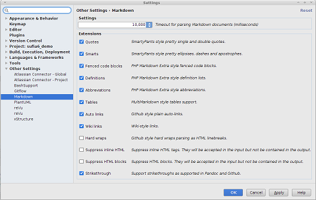

<!-- lib/doc/markdown/plugin.md -->
  
# Markdown Plugin for RubyMine                                  <a name="top"/>

  If you install the Markdown plugin in RubyMine (File|Settings|Plugins) you
  can more fully use Markdown files for documentation purposes while coding or
  viewing the project through RubyMine.  The plugin adds two features:

  - **Markdown syntax highlighting**  
    This makes the contents of the file easier to read even displayed as text
    in RubyMine.   

  - **Markdown preview tab**  
    This adds adds a "Preview" tab to the bottom of the window for a Markdown
    file which displays the file in formatted form.

## Installation                                        <a name="installation"/>

  To add these features, install the Markdown plugin from **File|Settings**
  under the **Plugins** selection.  Check the box to the right of the
  "Markdown" entry and press "OK" to install the plugin.  After installation,
  options for the plugin will found in the **Other Settings** selection.
  
<<<<<<< HEAD
  
=======
  
>>>>>>> Remove percent character from image names
   [Full size image](images/MarkdownPlugin.png)

## Settings                                                <a name="settings"/>

  The following are the preferred settings for this plugin:
    
  
| Extension             | Setting |
| --------------------- |:-------:|
| Quotes                | **on**  |
| Smarts                | **on**  |
| Fenced code blocks    | **on**  |
| Definitions           | **on**  |
| Abbreviations         | **on**  |
| Tables                | **on**  |
| Auto links            | **on**  |
| Wiki links            | **on**  |
| Hard wraps            | off     |
| Suppress inline HTML  | off     |
| Suppress HTML blocks  | off     |
| Strikethrough         | **on**  |

  \[[*Back to top*](#top)\]
