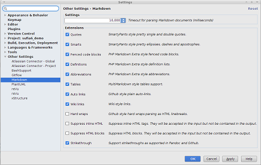

<!-- lib/doc/markdown/plugin.md -->
  
# Markdown Plugin for RubyMine

  If you install the Markdown plugin in RubyMine (File|Settings|Plugins) you
  can more fully use Markdown files for documentation purposes while coding or
  viewing the project through RubyMine.  The plugin adds two features:

  - **Markdown syntax highlighting**  
    This makes the contents of the file easier to read even displayed as text
    in RubyMine.   

  - **Markdown preview tab**  
    This adds adds a "Preview" tab to the bottom of the window for a Markdown
    file which displays the file in formatted form.

## Installation

  To add these features, install the Markdown plugin from **File|Settings**
  under the **Plugins** selection.  Check the box to the right of the
  "Markdown" entry and press "OK" to install the plugin.  After installation,
  options for the plugin will found in the **Other Settings** selection.
  
  
   [Full size image](images/MarkdownPlugin.png)

## Settings

  The following are the preferred settings for this plugin.
    
  
| Extension             | Setting | Description                               |
| --------------------- |:-------:| ----------------------------------------- |
| Quotes                | **on**  | xxx |
| Smarts                | **on**  | xxx |
| Fenced code blocks    | **on**  | xxx |
| Definitions           | **on**  | xxx |
| Abbreviations         | **on**  | xxx |
| Tables                | **on**  | xxx |
| Auto links            | **on**  | xxx |
| Wiki links            | **on**  | xxx |
| Hard wraps            | off     | xxx |
| Suppress inline HTML  | off     | xxx |
| Suppress HTML blocks  | off     | xxx |
| Strikethrough         | **on**  | xxx |

   

---

### Quotes

  TODO

### Smarts

  TODO
  
   

---

### Fenced code blocks

  TODO
  
   

---

### Definitions

  TODO
  
   

---

### Abbreviations

  TODO
  
   

---

### Tables

  TODO
  
   

---

### Auto links

  TODO
  
   

---

### Wiki links

  TODO
  
   

---

### Hard Wraps

  TODO
  
   

---

### Suppress inline HTML

  TODO
  
   

---

### Suppress HTML blocks

  TODO
  
   

---
